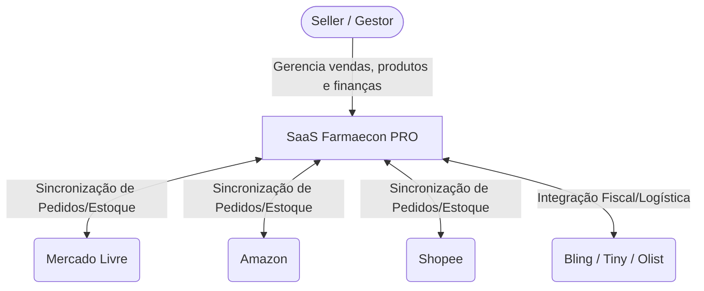
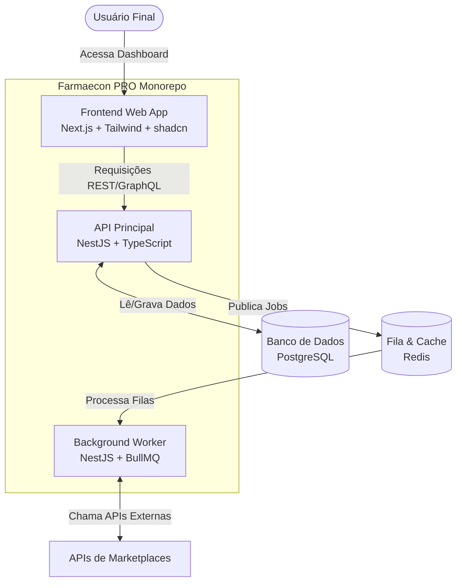
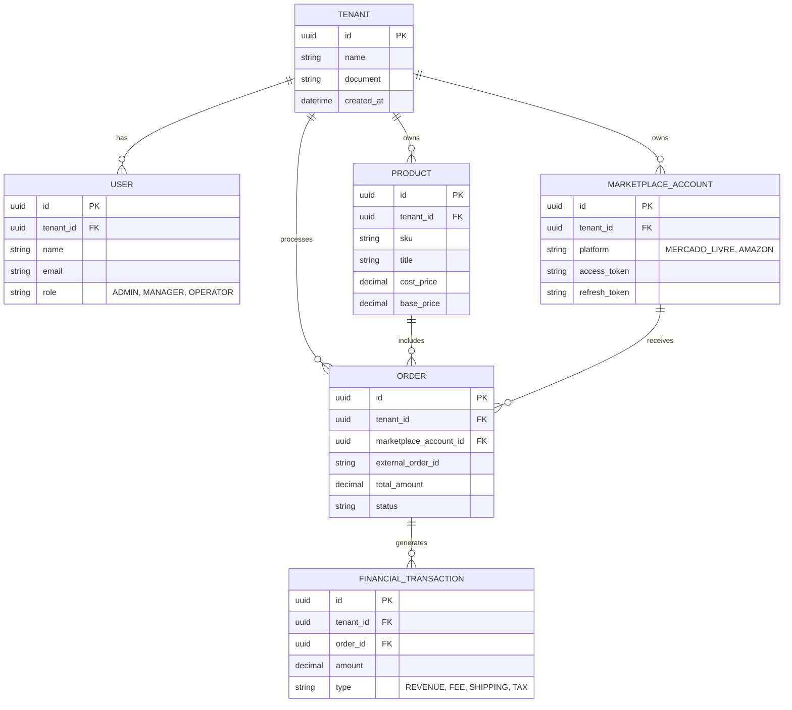

# Arquitetura do Sistema: Farmaecon PRO

Este documento detalha a arquitetura do SaaS Multi-Marketplace **Farmaecon PRO**, desenhado para alta escalabilidade, isolamento de inquilinos (multi-tenant) e integração contínua com diversos marketplaces.

## 1. Visão Geral (C4 Model - Contexto)

O sistema Farmaecon PRO atua como um hub central, conectando os sellers (usuários do SaaS) aos seus respectivos marketplaces e sistemas ERP.

## 2. Componentes e Tecnologias (C4 Model - Container)

A arquitetura baseia-se num **Monorepo** para facilitar o compartilhamento de tipos (TypeScript) entre Frontend e Backend.

### Decisões Tecnológicas
- **Frontend:** Next.js (App Router) para SSR e performance otimizada, TailwindCSS e shadcn/ui para design system premium e responsivo. TanStack Table e Recharts para grids complexos e visualização de dados.
- **Backend Core:** NestJS, que oferece injeção de dependências robusta e facilita a criação de módulos isolados (Auth, Finance, Integrations).
- **Banco de Dados:** PostgreSQL, modelado com campos `tenant_id` em todas as tabelas transacionais para garantir isolamento. Acesso a dados feito via Prisma ORM.
- **Assincronicidade e Jobs:** Redis + BullMQ. Fundamental para processar webhooks de marketplaces, sincronizar estoques em massa e gerar relatórios pesados sem bloquear a API principal.

## 3. Modelo de Dados Principal (ERD Simplificado)

O banco é relacional e desenhado para suporte multi-tenant (várias empresas/sellers) e multi-conta (várias contas de ML, Amazon sob o mesmo tenant).

## 4. Segurança e Multi-Tenant

- **Autenticação:** JWT (JSON Web Tokens) com Refresh Tokens.
- **RBAC (Role-Based Access Control):** Controle granular. Um *Operador* não pode acessar o módulo DRE, apenas um *Gestor* ou *Admin*.
- **Isolamento de Dados (Tenant Isolation):** Todas as queries do Prisma devem obrigatoriamente injetar o `tenant_id` do usuário logado usando features do Prisma Client Extensions ou Guards/Interceptors do NestJS.
- **Tokens de Integração:** `access_token` de marketplaces são encriptados at-rest no banco de dados usando AES-256.

## 5. Escalabilidade e Deploy

A infraestrutura inicial usará Docker (através de `docker-compose` para ambiente de desenvolvimento).
Para a produção, os serviços devem ser conteinerizados separadamente (API e Worker) para permitir o escalonamento horizontal dos Workers independentemente da API. CI/CD será gerido via GitHub Actions.
